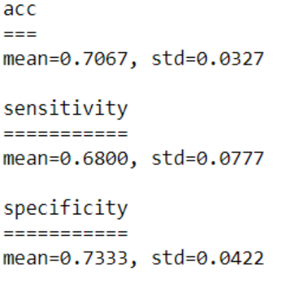
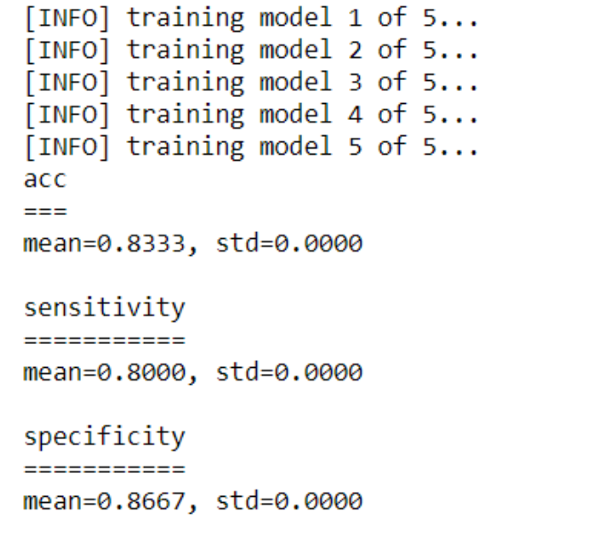

# Detecting Parkinson's with OpenCV, Computer Vision without Deep Learning

## What is Parkinson's disease?


Patients with Parkinson's disease have nervous system issues. Symptoms include movement issues such as tremors and muscle rigidity. Graciously, Joao Paulo Folador, shared his dataset consisting of spiral and wave drawings from Parkinson's patients and healthy participants. Traditional CV approach is taken to use the HOG image descriptor + Random Forest classifier(and also XGBoost) to perform classification. In the second phase, Beysian-based parameter optimizer is applied to optimize the prediction result.

Incentive: While Parkinson's cannot be cured, **early detection along with proper medication can significantly improve symptoms and quality of life**, making it an important for the medical field.

## Acknowledgement:

*A 2017 study by Zham et al. concluded that it is possible to detect Parkinson's by asking the patient to draw a spiral while tracking the speed of pen movement and pressure.* 

Many thanks to Adrian Rosebrock from [PyImage](https://www.pyimagesearch.com/) for OpenCV tutorial

## Drawing spirals and waves to detect Parkinson's disease


The important conclusion is that, for Parkinson's patients: 

1. The drawing speed is **slower**
2. The pen pressure is **lower**

In addition, we can leverage the fact that the *tremors* and *muscle rigidity* will directly impact the visual appearance of a hand drawn spiral and wave.


The dataset is created by Adriano de Oliveira Andrade and Joao Paulo Folado from the NIATS of Federal University of Uberlandia.

The dataset consists of 204 images:

* **Spiral**: 102 images, 72 training, and 30 testing
* **Wave**: 102 images, 72 training, and 30 tresting

It's very temping to use CNNs to solve this problem, the immediate hurdle is that 72 images is not quite sufficient for DL methods. Data augmentation is also quite challenge to be applied in this case. Therefore, traditional CV techniques are used in this case <span style="color:blue"> Histogram of Oriented Gradients (HOG) image descriptor</span>.

## Functions used in this application

```python
from sklearn.ensemble import RandomForestClassifier
from sklearn .preprocessing import LabelEncoder
from sklearn.metrics import confusion_matrix
from skimage import feature
from imutils import build_montages
from imutils import paths
import numpy as np
import argparse
import cv2
import os
import xgboost as xgb
```

*<span style="color:blue">Confusion_matrix</span>*: derive accuracy, sensitivity and specificity.

*<span style="color:blue">skimage.feature</span>*: get Histogram of Oriented Gradients (HOG)

*<span style="color:blue">build_montages</span>*: used for visualization

## A review on HOG and its parameters in SK-image

```python
def quantify_image(image):
    # compute the HOG feature vector for the input image
    features = feature.hog(image, 
                           orientations=9, 
                           pixels_per_cell=(10, 10), 
                           cells_per_block=(2,2),
                           transform_sqrt=True, 
                           block_norm="L1"
                           )
    return features
```

HOG is a *structural descriptor* that will capture and quantify changes in local gradient in the input image. HOG will naturally be able to quantify how the directions of the both **spirals** and **waves** change. The dimensionality of the <span style="color:red">feature vecor</span> is dependent on the parameters chosen for *<span style="color:purple">[orientations]</span>*,*<span style="color:purple">[pixels_per_cell]</span>*, and *<span style="color:purple">[cells_per_block]</span>*.

The cornerstone of the HOG descriptor algorithm is that **the appearance of an object** can be modeled by the distribution of intensity gradients inside rectangular regions of an image.


Implementing HOG descriptor quires dividing the image into small connected regions called **cells**. Then for each **cell**, compute a histogram of oriented gradients for the **pixels** within each **cell**. Finally, accumulate these histograms across multiple cells to form the <span style="color:red">feature vecor</span>.

*<span style="color:purple">[transform_sqrt]</span>* compresses the input pixel intensities and might improve accuracy.

*<span style="color:purple">[pixels_per_cell]</span>* determine the number of **pixels** belonging in each **cell**. The example below is a 128x128 image with *<span style="color:purple">[pixels_per_cell] = (8, 8)</span>* .


*<span style="color:purple">[orientations]</span>* defines number of bins in the resulting histogram. The gradient angle ranges [0,180]. A preferable range is [9,12].

*<span style="color:purple">[cells_per_block]</span>*: now, **"cells"** are grouped into **"blocks"**. It is common for these **blocks** to overlap, meaning that each cell contributes to the final <span style="color:red">feature vecor</span> more than once. (2,2) or (3,3) is recommended for good accuracy.


## Handle image path, preprocessing, and obtain HOG features

```python
def load_split(path):
    # grab the list of images in the input directory, then initialize the list of data(i.e., images) and class labels
    imagePaths = list(paths.list_images(path))
    data = []
    labels = []    
    # loop over the image paths
    for imagePath in imagePaths:
        # extract the class label from the filename
        label = imagePath.split(os.path.sep)[-2]
        # load the input image, convert it to grayscale, and resize it to 200x2000 pixels, ignoring aspect ratio
        image = cv2.imread(imagePath)
        image = cv2.cvtColor(image, cv2.COLOR_BGR2GRAY)
        image = cv2.resize(image, (200,200))
        # Threshold the image such that the drawing appears as white on a black background
        image = cv2.threshold(image,0,255, cv2.THRESH_BINARY_INV|cv2.THRESH_OTSU)[1]
        # quantify the image
        features = quantify_image(image)
        # update the data and labels lists, respectively
        data.append(features)
        labels.append(label)
    return (np.array(data), np.array(labels))
```

This function is applied later to each "given path". *<span style="color:blue">load_split(path)</span>* take the *path* to the dataset and returns all **HOG features** and associated class **labels**。

*<span style="color:blue">imagePaths</span>* is a list of *"path object"* to each individual image. The preprocessing includes: converting to grayscale $\Rightarrow$ resizing $\Rightarrow$ thresholding while white foreground and black background.

 <span style="color:blue">`label = imagePath.split(os.path.sep)[-2]`</span> return the label as the *"folder name"* that contains the image.

```python
dataset_path = r'C:\Users\medical_robot\Documents\Python Scripts\OpenCV+DL\detect-parkinsons\dataset\wave'
trials = 5
trainingPath = os.path.sep.join([dataset_path,"training"])
testingPath = os.path.sep.join([dataset_path, "testing"])

# load the traning and testing data
print("[INFO] loading data...")
(trainX, trainY) = load_split(trainingPath)
(testX, testY) = load_split(testingPath)

# Encode the labels as integers
le = LabelEncoder()
trainY = le.fit_transform(trainY)
testY = le.transform(testY)

#initialize or trials dicitonary
trials = {}
```

`(trainX, trainY)` and `(testX, testY)` obtained. 

**healthy** is labeled as '0'. **Parkinson** is labeled as '1'.

## Train the model, make predictions and compute confusion matrix

```python
# loop over the number of trials to run
for i in range(0, trial_num):
    # train the model
    print(f"[INFO] training model {i+1} of {trial_num}...")
    model = RandomForestClassifier(n_estimators=100)
    model.fit(trainX, trainY)
    
    # make predictions on the testing data and initialize a dictionary to store our computed metreics
    predictions = model.predict(testX)
    metrics = {}
    
    # compute the confusion matrix and use it to derive the raw accuracy, ensitivity, and specificity
    cm = confusion_matrix(testY, predictions).flatten()
    (tn, fp, fn, tp) = cm
    metrics["acc"] = (tp + tn) / float(cm.sum())
    metrics["sensitivity"] = tp / float(tp + fn)
    metrics["specificity"] = tn / float(tn + fp)
    
    # loop over the metrics
    for (k,v) in metrics.items():
        # update the trialas dictionary with the list of values for the current metric
        l = trials.get(k, [])
        l.append(v)
        trials[k] = l

# loop over our metrics
for metric in ("acc", "sensitivity", "specificity"):
    # grab the list of values for the current metric, then compute the mean and standard deviation
    values = trials[metric]
    mean = np.mean(values)
    std = np.std(values)
    
    # show the computed metrics for the statistic
    print(metric)
    print('='*len(metric))
    print(f'mean={mean:.4f}, std={std:.4f} \n')  
```

This part is very self-explanatory. We consider the mean value of 5 trials of training Random Forest model (Initialized at the beginning of each trial).

## Visualize the testing prediction

```python
# randomly select a few images and then initialize the output image for the montage
testingPaths = list(paths.list_images(testingPath))
idxs = np.arange(0, len(testingPaths))
idxs = np.random.choice(idxs, size=(25,), replace=False)
images = []

# loop over the trsting samples
for i in idxs:
    # load the teting image, clone it, and resize it
    image = cv2.imread(testingPaths[i])
    output = image.copy()
    output = cv2.resize(output, (128,128))
    
    # pre-process the image in the same manner we did earlier
    image = cv2.cvtColor(image, cv2.COLOR_BGR2GRAY)
    image = cv2.resize(image, (200, 200))
    image = cv2.threshold(image, 0, 255,cv2.THRESH_BINARY_INV | cv2.THRESH_OTSU)[1]
    
    # quantify the image and make predictions based on the extracted features using the last trained RF
    features = quantify_image(image)
    preds = model.predict([features])
    label = le.inverse_transform(preds)[0]
    
    # draw the colored class label on the output image and add it to the set of output images
    color = (0, 255, 0) if label == "healthy" else (0, 0, 255)
    cv2.putText(output, label, (3, 20), cv2.FONT_HERSHEY_SIMPLEX, 0.5, color, 2)
    images.append(output)    

# create a montage using 128x128 "titles" with 5 rows and 5 columns
montage = build_montages(images, (128,128), (5,5))[0]
# show the output montage
cv2.imshow("Output", montage)
cv2.waitKey(0)
cv2.destroyAllWindows()
```

25 testing image is randomly sampled. They are labeled according to **RF** predictions and are displayed with *<span style="color:blue">`imutils.build_montages`</span>* function.


## Prediction accuracy with Random Forest



70.67% accuracy for **wave** drawings

# Improvement on machine learning models

Bayesian optimization is applied to both Random Forest and XGBoost in this application to find the best classifier for HOG features:

### Importing hyperparameter-tuning functions

```python
from hyperopt import space_eval, hp, tpe, STATUS_OK, Trials, fmin
from hyperopt.pyll import scope
from sklearn.model_selection import cross_val_score, KFold
```

The *<span style="color:blue">`hyperopt`</span>* is used to do hyperparameter tuning. It's Bayesian optimizer that features **Tree-based Parzen Estimator** for parameter proposition. Typically, when we have a large parameter space to search, Bayesian-based method would perform more efficiently than grid search or random search.

### Tuning for RF

```python
# Bayesian optimization for RandomForest
space = {
        'n_estimators' : hp.quniform('n_estimators', 100, 1000, 25),
        'max_depth' : hp.quniform('max_depth', 1,20,1),
        'max_features': hp.choice('max_features', ['auto','sqrt','log2', 0.5, None]),
        'min_samples_leaf': hp.quniform('min_samples_leaf', 4,30,2),
}
trial = Trials()
def hyperopt_RandomForest(space):
    model = RandomForestClassifier(n_estimators= int(space['n_estimators']),max_features= space['max_features'],max_depth= int(space['max_depth']),min_samples_leaf= int(space['min_samples_leaf'])                        
                           )
    
    score = cross_val_score(model,
                            trainX, 
                            trainY, 
                            cv  = 5,
                            scoring='accuracy'                                            )
    
    print(f"Accuracy Score {score.mean():.3f} params {space}")
    return {'loss':(1 - score.mean()), 'status': STATUS_OK}
best = fmin(fn=hyperopt_RandomForest,
            space=space,
            algo=tpe.suggest,
            trials=trial,
            max_evals=300)
print(best)
clf = RandomForestClassifier(n_estimators=int(best['n_estimators']),max_features= ['auto','sqrt','log2', 0.5, None][best['max_features']],max_depth= int(best['max_depth']),min_samples_leaf= int(best['min_samples_leaf']))
```

### Tuning for XGBoost

```python
# Bayesian optimization for XGBClassifier

space = {
        'max_depth': hp.quniform('max_depth', 2, 20, 1),
        'min_child_samples': hp.quniform ('min_child_samples', 1, 20, 1),
        'subsample': hp.uniform ('subsample', 0.8, 1),
        'n_estimators' : hp.quniform('n_estimators', 50,1000,25),
        'learning_rate' : hp.loguniform('learning_rate', np.log(0.005), np.log(0.2)),
        'gamma' : hp.uniform('gamma', 0, 1),
        'colsample_bytree' : hp.uniform('colsample_bytree', 0.3, 1.0)
}
trial = Trials()
def hyperopt_XGBClassifier(space):
    model = xgb.XGBClassifier(n_estimators= int(space['n_estimators']),
                               max_depth = int(space['max_depth']),
                               min_child_samples = space['min_child_samples'],
                               subsample = space['subsample'],
                               learning_rate= space['learning_rate'],
                               gamma = space['gamma'],
                               colsample_bytree = space['colsample_bytree']
                               )
    
    score = cross_val_score(model,
                            trainX, 
                            trainY, 
                            cv  = 5,
                            scoring='accuracy'                            
                           )

    print(f"Accuracy Score {score.mean():.3f} params {space}")
    return {'loss':(1 - score.mean()), 'status': STATUS_OK}
best = fmin(fn=hyperopt_XGBClassifier,
            space=space,
            algo=tpe.suggest,
            trials=trial,
            max_evals=3)
print(best)
clf = xgb.XGBClassifier(n_estimators = int(best['n_estimators']),
                   max_depth = int(best['max_depth']),
                   min_child_samples = best['min_child_samples'],
                   subsample = best['subsample'],
                   learning_rate = best['learning_rate'],
                   gamma = best['gamma'],
                   colsample_bytree = best['colsample_bytree'])
```

### Prediction result of XGBoost

XGBoost was found to out-perform RF after tuning. Parameters were stored in dictionary<span style="color:blue"> `best`</span>.

```python
# loop over the number of trials to run
for i in range(0, trial_num):
    # train the model
    print(f"[INFO] training model {i+1} of {trial_num}...")
    clf = xgb.XGBClassifier(n_estimators = int(best['n_estimators']),
                           max_depth = int(best['max_depth']),
                           min_child_samples = best['min_child_samples'],
                           subsample = best['subsample'],
                           learning_rate = best['learning_rate'],
                           gamma = best['gamma'],
                           colsample_bytree = best['colsample_bytree'])
    clf.fit(trainX, trainY)
    
    # make predictions on the testing data and initialize a dictionary to store our computed metreics
    predictions = clf.predict(testX)
    metrics = {}
    
    # compute the confusion matrix and use it to derive the raw accuracy, ensitivity, and specificity
    cm = confusion_matrix(testY, predictions).flatten()
    (tn, fp, fn, tp) = cm
    metrics["acc"] = (tp + tn) / float(cm.sum())
    metrics["sensitivity"] = tp / float(tp + fn)
    metrics["specificity"] = tn / float(tn + fp)
    
    # loop over the metrics
    for (k,v) in metrics.items():
        # update the trialas dictionary with the list of values for the current metric
        l = trials.get(k, [])
        l.append(v)
        trials[k] = l

# loop over our metrics
for metric in ("acc", "sensitivity", "specificity"):
    # grab the list of values for the current metric, then compute the mean and standard deviation
    values = trials[metric]
    mean = np.mean(values)
    std = np.std(values)
    
    # show the computed metrics for the statistic
    print(metric)
    print('='*len(metric))
    print(f'mean={mean:.4f}, std={std:.4f} \n') 
```


For **Wave** drawing dataset, accuracy improved from <span style="color:red">70.67%</span> to <span style="color:green">**83.33%**</span>.

